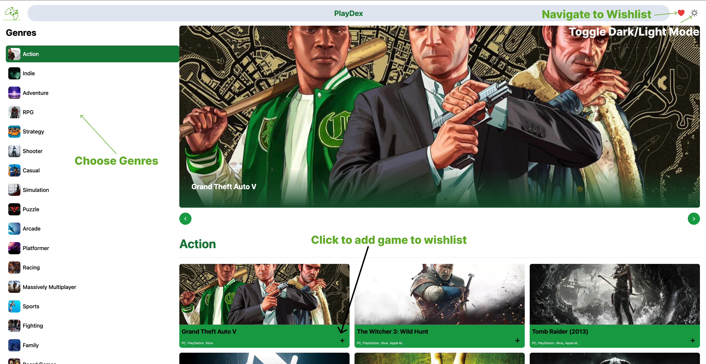
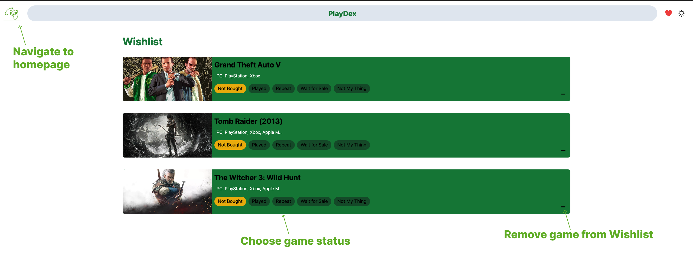
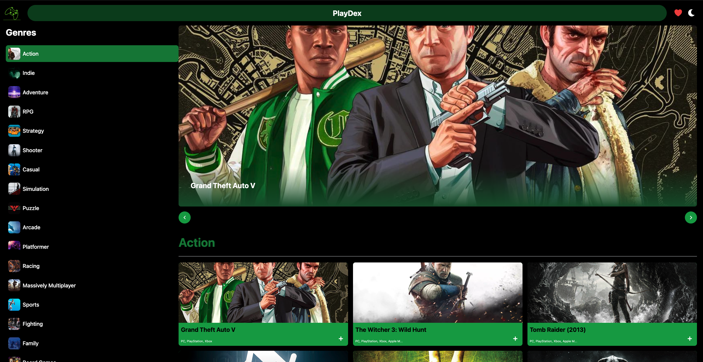

# PlayDex

PlayDex is a web application that allows users to explore and manage their game wishlist. It provides a curated list of games across various genres, and users can add games to their wishlist, update their status, and view their wishlist.

Click this link to navigate to the application:
https://play-dex.vercel.app/

## Screenshots

**Home Page**

**Wishlist Page**

**Dark Mode**

## Features

- **Explore Games**: Browse through a list of games categorized by genres.
- **Wishlist Management**: Add games to your wishlist, update their status, and view your wishlist.
- **Dark Mode Support**: Enjoy the app in both light and dark modes.

## Getting Started

To get a local copy up and running, follow these steps:

1. Clone the repository:
   git clone https://github.com/antzash/PlayDex.git

2. Install the dependencies:
   npm install

3. Start the development server:
   npm run dev

4. Open your browser and navigate to `http://localhost:3000`.

## Built With

- [React](https://reactjs.org/) - The JavaScript library for building user interfaces.
- [Vite](https://vitejs.dev/) - The build tool and development server.
- [Tailwind CSS](https://tailwindcss.com/) - The utility-first CSS framework.
- [Airtable](https://airtable.com/) - The backend service for storing wishlist data.

## Contact

Your Name - Anthony Hashwin
Email - antony.hashwin@gmail.com

Project Link: [https://github.com/antzash/PlayDex](https://github.com/antzash/PlayDex)
